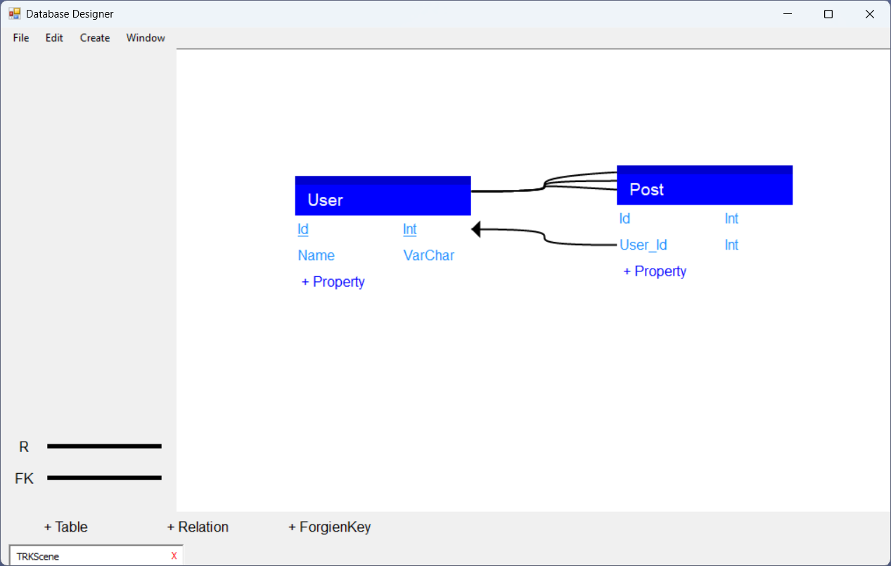

# Database Designer
- Build EER diagrams and and automatically convert them into Relational
Tables.
- Build Flow Diagrams
- Build Database Tables and Relations directly
- Generate basic SQL commands
- Save, open, and edit files

## Screenshots

